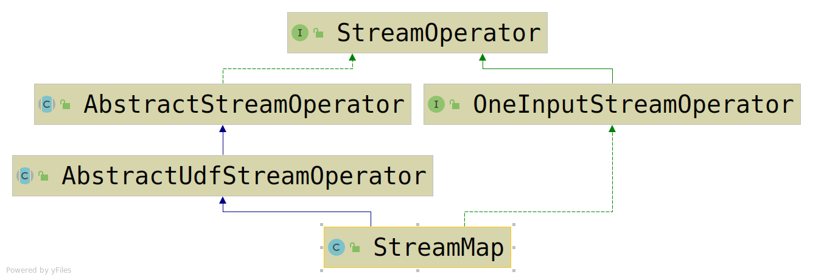
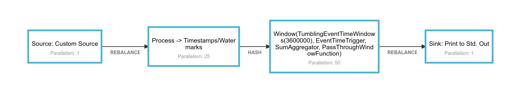
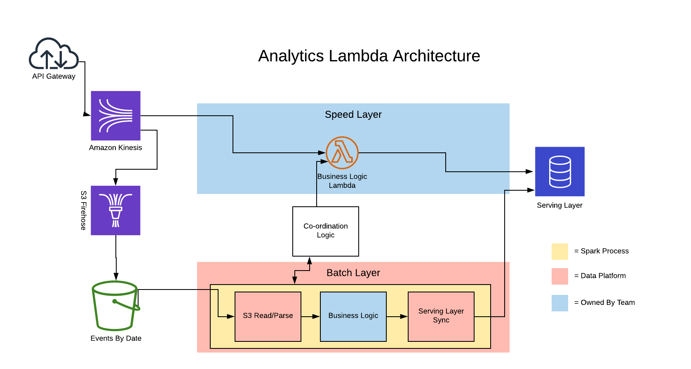
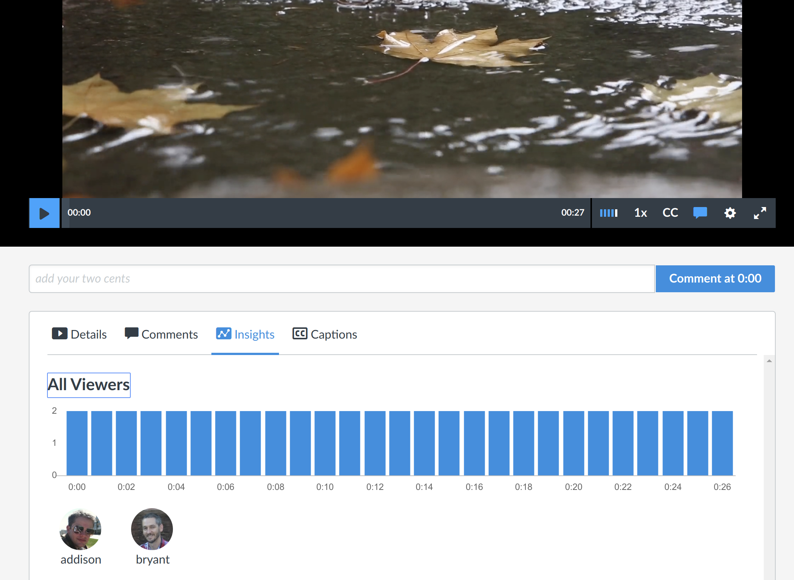
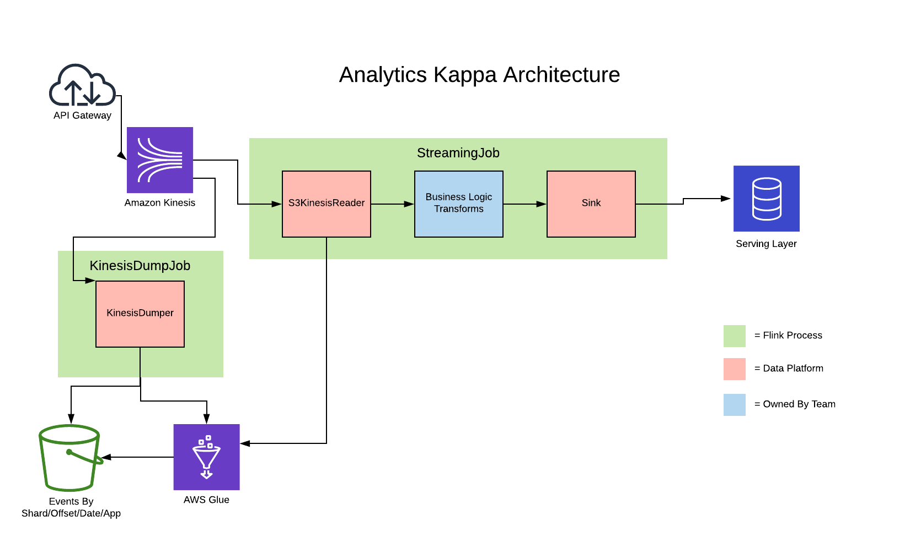
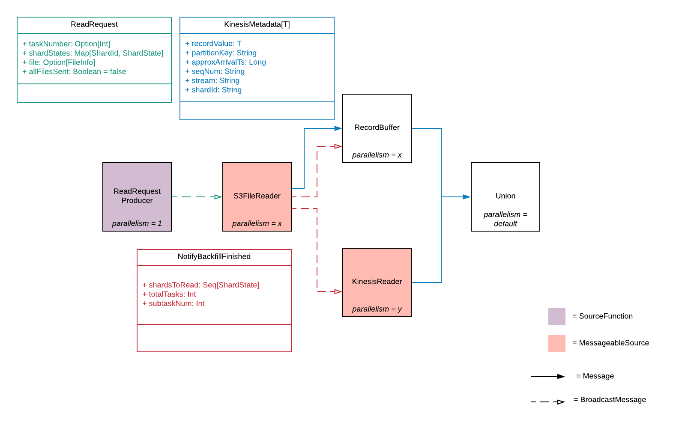
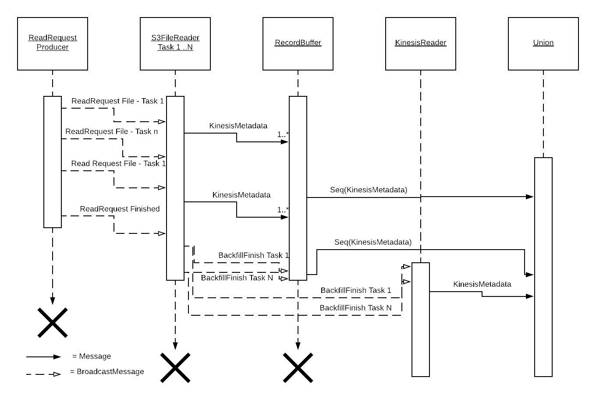

<h1 class="mainTitle">Becoming a Smooth Operator</h1>
<h2 class="mainTitle">A look at the StreamOperator API</h2>

---

## Who am I?

----


- Cloud/Data Guy at Instructure
- github.com/addisonj
- twitter/addisonjh

----


### From the first day of school to the last day of work

----

<div style="display: flex; justify-context: space-evenly;">
  <div>
    
    <p style="vertical-align: middle">Learning Management System</p>
  </div>
  <div>
    
    <p style="vertical-align: middle">Employment Development</p>
  </div>
</div>

----

### How We Use Flink
#### Get more data to customers faster

- Fast and correct ETLs
- Large scale aggregations for analytics
- Still new effort, but growing

<div style="font-size: 0.5em"><em>We are hiring, talk to me if that sounds interesting</em></div>

---

## How I knew Flink was great

----

- Technology <!-- .element: class="fragment strike" data-fragment-index="1" -->
- Community <!-- .element: class="fragment strike" data-fragment-index="2" -->
- Best Apache Animal Logo <!-- .element: class="fragment fade-in" data-fragment-index="3" -->

Note: Started with flink over 2 years ago

----


### Simple, but okay

----


### Off-brand Mario

----


### Nightmare Fuel

----


### Clearly the winner

---

## What we will cover today

----

### The `StreamOperator` API

- What it is and how it fits in with the other Flink APIs
- What it enables and how Flink uses it
- Some examples of what advanced functionality you can do with it

---

## The Many Layers of Flink

----


Note: you have probably seen this before, but as a review, lets look in depth at some of those layers

----

### Flink SQL

<pre><code class="lang-Scala" style="font-size: 0.7em; line-height: 1.2em" data-trim>
case class Student(id: Long, name: String)
case class Grade(id: Long, assignmentId: Long, studentId: Long, score: Int)
...
val students = env.fromCollection(Seq(
  Student(1, "Jane"),
  Student(2, "Bill"),
  Student(3, "Addison")
))
val grades = env.fromCollection(Seq(
  Grade(1, 1, 1, 85),
  Grade(2, 1, 2, 79),
  Grade(3, 1, 3, 42),
  Grade(4, 1, 3, 42)
))
val tableEnv = TableEnvironment.getTableEnvironment(env)
tableEnv.registerDataStream("Students", students)
tableEnv.registerDataStream("Grades", grades)
val fails = tableEnv.sqlQuery("""
SELECT * FROM Grades INNER JOIN Students ON Grades.studentId = Students.id
WHERE Grades.score &lt; 60
""")

</code></pre>

Note: lowest common denominator, easy to understand and relatively flexible, but you can't express everything

----

### "High Level" Stream APIs (map, filter, window, etc)

<pre><code class="lang-Scala" style="font-size: 0.7em; line-height: 1.2em" data-trim>
case class Grade(id: Long, assignmentId: Long, studentId: Long, score: Int, attempt: Int)
val grades = env.fromCollection(Seq(
  Grade(1, 1, 1, 85, 1),
  Grade(2, 1, 2, 79, 1),
  Grade(3, 1, 3, 42, 1),
  Grade(4, 1, 3, 42, 2)
))

val avgFirstsAttempt = grades
  .keyBy("assignmentId")
  .filter((grade) => grade.attempt == 0)
  // just store everything in one window
  .window(GlobalWindows.create())
  // a trigger that fires every n seconds
  .trigger(new PeriodicFiringTrigger())
  // an aggregate function to keep a running average
  .aggregate(new AverageAggregate())
</code></pre>

Note: They expose a lot more functionality (precise control over graph, custom state, etc), but comes at a cost and a lot is still hidden

----

### "Low Level" Stream APIs (process, async, broadcast, etc)

<pre><code class="lang-Scala" style="font-size: 0.5em; line-height: 1.2em" data-trim>
case class Grade(id: Long, assignmentId: Long, studentId: Long, score: Int, attempt: Int, dueAt: Instant)
case class NotifyFail(studentId: Long, message: String)
val grades = env.fromCollection(Seq(
  Grade(1, 1, 1, 85, 1, Instant.parse("2019-04-01T23:50:00Z")),
  Grade(2, 1, 2, 79, 1, Instant.parse("2019-04-01T23:50:00Z")),
  Grade(3, 1, 3, 42, 1, Instant.parse("2019-04-01T23:50:00Z")),
  Grade(4, 1, 3, 42, 2, Instant.parse("2019-04-01T23:50:00Z"))
))

val notifyFailingGrades = grades.
  keyBy("assignmentId", "studentId")
  process(new KeyedProcessFunction[Grade, NotifyFail] with RichFunction {
    private val WarnTime = 1000 * 60 * 60 // one hour
    private val WarnScore = 60 // warn if score is failing
    lazy private val bestGrade: ValueState[Grade] = getRuntimeContext().getState("bestGrade", ...)
    override def processElement(el: Grade, ctx: Context, coll: Collector[NotifyFail]): Unit = {
      if (bestGrade.get == null) {
        val warnAt = el.dueAt.toEpochMilli() - WarnTime
        ctx.timerService.registerProcessingTimeTimer(warnAt)
      }
      if (el.score &gt; Option(bestGrade.get()).map(_.score).getOrElse(-1)) {
        bestGrade.update(el)
      }
    }
    override def onTimer(ts Long, ctx: OnTimerContext, coll: Collector[NotifyFail]): Unit = {
      val grade = bestGrade.get()
      if (grade.score &lt; WarnScore) {
        coll.collect(NotifyFail(grade.studentId, s"You are failing assignment ${grade.assignmentId}"))
      }
    }
  })
</code></pre>

Note: We get even more control, timers, multiple outputs, keys

----


----

### Is that all we get?

- checkpoint barriers, watermarks, latency marker handling?
- state snapshotting?
- per-key state magic?
- ... everything else?

----

### Public vs Private APIs?


----

### Flink's API Design Approach

<div style="font-size: 0.5em"><em>In my opinion</em></div>

- Flink marks very few classes/interfaces as private to allow users lots of flexibility
- However, guidelines are given via annotations and docs
- This encourages users to experiment and understand, without ossification or constant breakage

Note: public/total files in biggest modules: flink-streaming-java (345/355), flink-core (642/649), flink-runtime (1420/1501), by comparision, spark-core (222/949) classes are public

----


---

## `StreamOperator` API

----

### Warning

- The `StreamOperator` is marked as `PublicEvolving`, which means that it can
change between versions.
- Also, you can totally break your app and do weird things <!-- .element: class="fragment highlight-red" data-fragment-index="1" -->

----

### What it does

The `DataStream` API is built on top of the `StreamOperator`, in fact, each operation is
encapsulated inside a `StreamOperator` implementation

It primarily handles:
- interaction with runtime and internal APIs
- watermark and latency marker handling
- state snapshotting and managing key context

----

### What it looks like
<pre><code style="max-height: 550px; font-size: 0.7em; line-height: 1.2em" class="java" data-trim data-noescape>
// StreamOperator.java
@PublicEvolving
public interface StreamOperator&lt;OUT&gt; extends CheckpointListener, KeyContext, Disposable, Serializable {
  // lifecycle
  void setup(StreamTask&lt;?, ?&gt; containingTask, StreamConfig config, Output&lt;StreamRecord&lt;OUT&gt;&gt; output);
  void open() throws Exception;
  void close() throws Exception;
  void dispose() throws Exception;

  // state
  void prepareSnapshotPreBarrier(long checkpointId) throws Exception;
  OperatorSnapshotFutures snapshotState(...) throws Exception;
  void initializeState() throws Exception;
  // from CheckpointListener interface
  // void notifyCheckpointComplete(long checkpointId) throws Exception;

  // keys
  // from KeyContext interface
  // void setCurrentKey(Object key);
  void setKeyContextElement1(StreamRecord&lt;?&gt; record) throws Exception;
  void setKeyContextElement2(StreamRecord&lt;?&gt; record) throws Exception;
  ...
}
</code></pre>

----

### What it looks like (continued)

<pre><code style="max-height: 550px; font-size: 0.7em; line-height: 1.2em" class="java" data-trim data-noescape>
// OneInputStreamOperator.java
@PublicEvolving
public interface OneInputStreamOperator&lt;IN, OUT&gt; extends StreamOperator&lt;OUT&gt; {
  // process messages
  void processElement(StreamRecord&lt;IN&gt; element) throws Exception;
  void processWatermark(Watermark mark) throws Exception;
  void processLatencyMarker(LatencyMarker latencyMarker) throws Exception;
}
</code></pre>

or

<pre><code style="max-height: 550px; font-size: 0.7em; line-height: 1.2em" class="java" data-trim data-noescape>
// TwoInputStreamOperator.java
@PublicEvolving
public interface TwoInputStreamOperator&lt;IN1, IN2, OUT&gt; extends StreamOperator&lt;OUT&gt; {
  // process messages x2
  void processElement1(StreamRecord&lt;IN1&gt; element) throws Exception;
  void processElement2(StreamRecord&lt;IN2&gt; element) throws Exception;
  void processWatermark1(Watermark mark) throws Exception;
  void processWatermark2(Watermark mark) throws Exception;
  void processLatencyMarker1(LatencyMarker latencyMarker) throws Exception;
  void processLatencyMarker2(LatencyMarker latencyMarker) throws Exception;
}
</code></pre>

----

### Some things look famaliar...

We still have methods for:
- hooking into lifecycle
- dealing with state
- processing messages

----

### However, we see a whole lot more

<ul style="font-size: 0.7em">
  <li><code class="small">void setup(StreamTask<?, ?>, StreamConfig, Output<StreamRecord<OUT>>)</code></li>
  <li><code class="small">OperatotSnapshotFuture snapshotState(...)</code></li>
  <li>Handlers for <code class="small">StreamRecord</code>, <code class="small">Watermark</code> and other messages</li>
  <li>dealing with keys</li>
</ul>

----

### And some things aren't so clear...

- How do we send messages downstream?
- How do we actually deal with state?
- How do we set timers?

----

### A Helping Hand

<p class="small">Luckily, we don't have to figure this all out, the `AbstractStreamOperator` gives us some help
in using this API</p>


```Scala
class MyFirstOperator
    extends AbstractStreamOperator[String]
    with OneInputStreamOperator[String, String] {

  override def processElement(element: StreamRecord[String]): Unit = {
    output.collect(element.replace(element.getValue + "!!!!"))
  }
}
```

----


### ... That's it?
#### Why would I want to use this?

---

## How Flink uses it

----

#### `TimestampsAndPeriodicWatermarksOperator`

----

### What does it do?

<p class="small">When you use any watermark extractor, it gets wrapped in a <code>TimestampsAndPeriodicWatermarksOperator</code></p>

<pre><code style="max-height: 550px; font-size: 0.7em; line-height: 1.2em" class="java" data-trim data-noescape>
class MyWatermarkExtractor extends AssignerWithPeriodicWatermarks[MyEvent] {
  private var maxTimestamp: Long = 0L
  override def extractTimestamp(element: MyEvent, previousElementTimestamp: Long): Long = {
    if (element.timestamp &gt; maxTimestamp) {
      maxTimestamp = element.timestamp
    }
    element.timestamp
  }
  override def getCurrentWatermark(): Watermark = new Watermark(maxTimestamp - 1)
}

dataStream.assignTimestampsAndWatermarks(new MyWatermarkExtractor)
</code></pre>


----

### The Code

<pre><code style="max-height: 550px; font-size: 0.7em; line-height: 1.2em" class="java" data-trim data-noescape>
public class TimestampsAndPunctuatedWatermarksOperator&lt;T&gt;
    extends AbstractUdfStreamOperator&lt;T, AssignerWithPunctuatedWatermarks&lt;T&gt;&gt;
    implements OneInputStreamOperator&lt;T, T&gt; {

  private static final long serialVersionUID = 1L;

  private long currentWatermark = Long.MIN_VALUE;

  public TimestampsAndPunctuatedWatermarksOperator(AssignerWithPunctuatedWatermarks&lt;T&gt; assigner) {
    super(assigner);
    this.chainingStrategy = ChainingStrategy.ALWAYS;
  }

  @Override
  public void processElement(StreamRecord&lt;T&gt; element) throws Exception {
    final T value = element.getValue();
    final long newTimestamp = userFunction.extractTimestamp(value,
        element.hasTimestamp() ? element.getTimestamp() : Long.MIN_VALUE);

    output.collect(element.replace(element.getValue(), newTimestamp));

    final Watermark nextWatermark = userFunction.checkAndGetNextWatermark(value, newTimestamp);
    if (nextWatermark != null && nextWatermark.getTimestamp() &gt; currentWatermark) {
      currentWatermark = nextWatermark.getTimestamp();
      output.emitWatermark(nextWatermark);
    }
  }
</code></pre>

----

### The Code (continued)

<pre><code style="max-height: 550px; font-size: 0.7em; line-height: 1.2em" class="java" data-trim data-noescape>
  /**
   * Override the base implementation to completely ignore watermarks propagated from
   * upstream (we rely only on the {@link AssignerWithPunctuatedWatermarks} to emit
   * watermarks from here).
   */
  @Override
  public void processWatermark(Watermark mark) throws Exception {
    // if we receive a Long.MAX_VALUE watermark we forward it since it is used
    // to signal the end of input and to not block watermark progress downstream
    if (mark.getTimestamp() == Long.MAX_VALUE && currentWatermark != Long.MAX_VALUE) {
      currentWatermark = Long.MAX_VALUE;
      output.emitWatermark(mark);
    }
  }
}
</code></pre>

----

### What we learn

- In `processElement` we get the `StreamRecord` which allows us modify not only the record, but it's timestamp
- In `processWatermark` we can change or completely ignore watermarks
- We have access to some low level APIs, such as `output` and `chainingStrategy` properties

----

### The `StreamOperator` pattern

<p class="small">As mentioned, all of the `DataStream` API is built on top of and encapsulated by the `StreamOperator` API</p>

<pre><code style="max-height: 550px; font-size: 0.7em; line-height: 1.2em" class="java" data-trim data-noescape>
public &lt;R&gt; SingleOutputStreamOperator&lt;R&gt; map(MapFunction&lt;T, R&gt; mapper) {
  TypeInformation&lt;R&gt; outType = ...;
  return transform("Map", outType, new StreamMap&lt;&gt;(clean(mapper)));
}
</code></pre>



---

## Our First Real Operator

----

### Handling a stream of files

#### We have a job that:

- has a single source which produces `FileReadRequest` messages, can send anywhere from 150 to 0.1 msgs/minute
- a process function which reads the file and produces roughly ~100k messages per file, these new messages contain our event-time
- downstream logic that re-keys and aggregates and sums into 1 hour windows

----

### In Code

<pre><code style="max-height: 550px; font-size: 0.7em; line-height: 1.2em" class="scala" data-trim data-noescape>
// our functions
class FileRequestSource extends SourceFunction[FileReadRequest] {...}
class FileReaderProcess extends ProcessFunction[FileReadRequest, FileMessage] {...}
class WatermarkAssigner extends AssignerWithPeriodicWatermarks[FileMessage] {...}
// our message types
case class FileReadRequest(uri: String)
case class FileMessage(sourceUri: String, timestamp: Long, id: String, value: Long)
// our job
class FileReaderDemo {
  def main(args: Array[String]): Unit = {
    val env = StreamExecutionEnvironment.getExecutionEnvironment
    env.setStreamTimeCharacteristic(TimeCharacteristic.EventTime)
    val fileStream    = env.addSource(new FileRequestSource)
    val messageStream = fileStream
      .process(new FileReaderProcess)
      .setParallelism(25)
      .assignTimestampsAndWatermarks(new WatermarkAssigner)

    messageStream
      .keyBy("id")
      .window(TumblingEventTimeWindows.of(Time.hours(1)))
      .sum("value")
      .setParallelism(50)
      .addSink(...)
  }
}
</code></pre>

----

### Job Graph



----

### Problems Arise

At low load, we start seeing no windows closing until load picks back up

Analysis shows the watermark isn't advancing

----

### Root Cause

At low load, we get roughly 6 msgs/hour

In an hour, only ~25% of readers will have a message to process, the rest will be idle

At this rate, it will take ~4 hours for all readers to get a message to process

Since we assign watermarks after our reader, the initial source doesn't generate watermarks

----
### Dealing with idle streams


<p class="small">The watermark for an operator is the minimum of all the input watermarks, when we have a single "source" that doesn't output any records, the watermark doesn't advance</p>

<p class="small">Without an advancing watermark, we can't close windows, and we stop getting results</p>

----

### How to fix it!

> Sources can be marked as idle using SourceFunction.SourceContext #markAsTemporarilyIdle

*From https://ci.apache.org/projects/flink/flink-docs-stable/dev/event_time.html#idling-sources*

----


#### Except... our source isn't what is idle...

----

### What is a source really?

In this case, the real "source" of most of our data is **not** the SourceFunction

With the operator API, we can work around this API limitation

Note: there are other options to fixing this, such as a differet watermark generation scheme,
but that still is a workaround when the problem is that the real bulk of our data isn't produced by the source

----

### Our new operator

<pre><code style="max-height: 550px; font-size: 0.7em; line-height: 1.2em" class="scala" data-trim data-noescape>
abstract class MessageableSource[IN, OUT](idleTimeout: Long)
    extends AbstractStreamOperator[OUT]
    with OneInputStreamOperator[IN, OUT] {
  private var sourceCtx: SourceContext[OUT] = _
  protected def sourceContext: SourceContext[OUT] = {
    if (sourceCtx == null) {
      sourceCtx = StreamSourceContexts.getSourceContext(
        getOperatorConfig.getTimeCharacteristic,
        getContainingTask.getProcessingTimeService,
        getContainingTask.getCheckpointLock,
        getContainingTask.getStreamStatusMaintainer,
        output,
        getRuntimeContext.getExecutionConfig.getAutoWatermarkInterval,
        idleTimeout
      )
    }
    sourceCtx
  }
  override def processElement(element: StreamRecord[IN]): Unit =
    processElement(element.getValue, sourceContext)

  def processElement(el: IN, sourceCtx: SourceContext[OUT]): Unit
}
</code></pre>


----

### Used in our new job

<pre><code style="max-height: 550px; font-size: 0.7em; line-height: 1.2em" class="scala" data-trim data-noescape>
// our functions
class FileRequestSource extends SourceFunction[FileReadRequest] {...}
class FileReaderSource extends MessageableSource[FileReadRequest, FileMessage](idleTimeout) {...}
class WatermarkAssigner extends AssignerWithPeriodicWatermarks[FileMessage] {...}
// our message types
case class FileReadRequest(uri: String)
case class FileMessage(sourceUri: String, timestamp: Long, id: String, value: Long)
// our job
class FileReaderDemo {
  def main(args: Array[String]): Unit = {
    val env = StreamExecutionEnvironment.getExecutionEnvironment
    env.setStreamTimeCharacteristic(TimeCharacteristic.EventTime)
    val fileStream    = env.addSource(new FileRequestSource)
    val messageStream = fileStream
      <span class="fragment highlight-red">.transform("fileReader", new FileReaderSource)</span>
      .setParallelism(25)
      .assignTimestampsAndWatermarks(new WatermarkAssigner)

    messageStream
      .keyBy("id")
      .window(TumblingEventTimeWindows.of(Time.hours(1)))
      .sum("value")
      .setParallelism(50)
      .addSink(...)
  }
}
</code></pre>

---

## What we needed to fix

----



----



Note: Arc is a video platform tailored for education and corporate that gives control and insights into what people are watching
Arc Insights shows data on how a video is being watched (or not). It is powered by a lambda architecture of spark batch and lambda/dynamo

----

### Lambda architectures are difficult to:

----

### Maintain

- It is a struggle to get teams to maintain one system, let alone two

- Batch and speed layer can be quite different, which requires broad knowledge for a team

Note: We aren't big enough to have seperate teams do all data transformations, so it is team's responsibility with consulting
Most of our teams consistent of people build REST apis and often not in JVM, so one new piece of technology can be a big ask

----

### Coordinate

- For certain problems, coordinating between the two systems can be difficult and error prone

----

### Debug

- When something goes wrong, knowing where the data came from (or didn't come from) is a challenge
- An outage in either system can really confuse users

----

### Justify

- With all the above challenges and with new stream processors, we found it hard to justify
continued effort into this solution

----

### Are Kappa Architecture a Silver Bullet?

#### A step in the right direction, but a lot of ways to go about it

----

### Stream Retention

- Still a very unsolved problem
- Many message transport layers don't support infinite retention at all (Kinesis) or it can be expensive (Kafka)
- Even with more advanced solutions (pulsar or pravega tiered storage), scaling reads is non-trivial

----

### Reuse Stream Logic with two sources

- Another common pattern is two re-use logic in different jobs with different sources
- This requires external automation and/or external state to co-ordinate between the two different jobs

----

### Our Approach To Kappa

- We weren't ready to move to a new streaming transport and no trim Kafka seemed scary
- We also wanted to avoid external automation or state if possible
- Can we do this all inside Flink?

---

## Flink makes that possible

----



----

### A better solution for archiving a stream

- By controlling our writes from Kinesis Streams to S3, we could read more granularly for backfill
- Additionally, by writing offset metadata to AWS Glue, we can seemlessly transition to Kinesis

----

### A more flexible "source"

- With the `StreamOperator` API and our own `MessageableSource` abstraction, we could build more flexible sources
- These sources allowed us to backfill data from S3, then transition to reading from Kinesis all with the same job graph

----



----



---

## In Conclusion

----

- The `StreamOperator` API is how Flink achieves a lot of the features we know and love
- Understanding it can make it easier to reason about your flink applications
- You can use it to do some really powerful things and build your own abstractions (but be careful)

----

### Talks you might want to see today:

- Towards Flink 2.0 - Nikko II & III at 2:00PM
- Moving From Lambda and Kappa to Kappa+ - Nikko II & III at 3:20PM

---

# Thanks!

## Questions?
