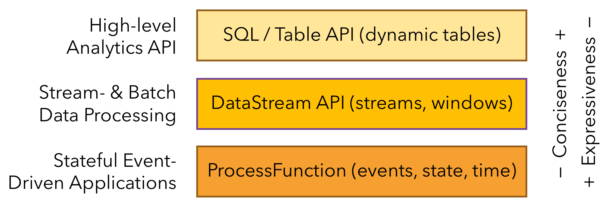
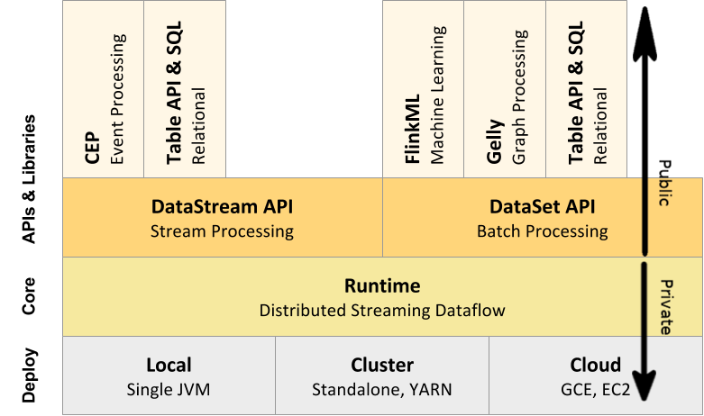
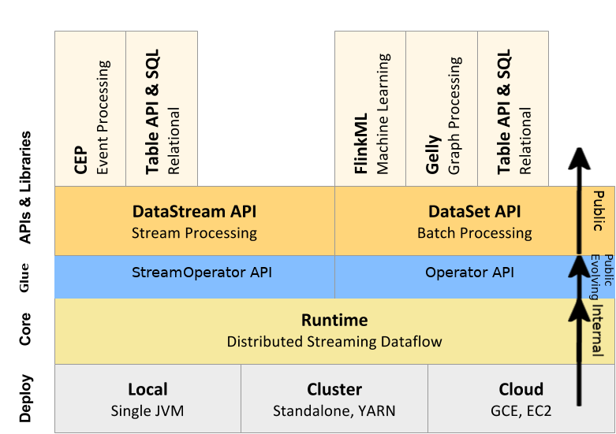

<h1 class="mainTitle">Becoming a Smooth Operator</h1>
<h2 class="mainTitle">A look at the StreamOperator API</h2>

---

## Who am I?

----


- Cloud/Data Guy at Instructure
- github.com/addisonj
- twitter/addisonjh

----


### From the first day of school to the last day of work.

----

<div style="display: flex; justify-context: space-evenly;">
  <div>
    
    <p style="vertical-align: middle">Learning Management System</p>
  </div>
  <div>
    
    <p style="vertical-align: middle">Employment Development</p>
  </div>
</div>

----

### How We Use Flink
#### Get more data to customers faster

- Fast and correct ETLs
- Large scale aggregations for analytics
- Still new effort, but growing

<div style="font-size: 0.5em"><em>We are hiring, talk to me if that sounds interesting</em></div>

---

## How I knew Flink was great

----

- Technology <!-- .element: class="fragment strike" data-fragment-index="1" -->
- Community <!-- .element: class="fragment strike" data-fragment-index="2" -->
- Best Apache Animal Logo <!-- .element: class="fragment fade-in" data-fragment-index="3" -->

Note: Started with flink over 2 years ago

----


### Simple, but okay

----


### Off-brand Mario

----


### Nightmare Fuel

----


### Clearly the winner

---

## What we will cover today

----

### The `StreamOperator` API

- What it is and how it fits in with the other Flink APIs
- What it enables and how Flink uses it
- Some examples of what advanced functionality you can do with it

---

## The Many Layers of Flink

----


Note: you have probably seen this before, but as a review, lets look in depth at some of those layers

----

### Flink SQL

<pre><code class="lang-Scala" style="font-size: 0.7em; line-height: 1.2em" data-trim>
case class Student(id: Long, name: String)
case class Grade(id: Long, assignmentId: Long, studentId: Long, score: Int)
...
val students = env.fromCollection(Seq(
  Student(1, "Jane"),
  Student(2, "Bill"),
  Student(3, "Addison")
))
val grades = env.fromCollection(Seq(
  Grade(1, 1, 1, 85),
  Grade(2, 1, 2, 79),
  Grade(3, 1, 3, 42),
  Grade(4, 1, 3, 42)
))
val tableEnv = TableEnvironment.getTableEnvironment(env)
tableEnv.registerDataStream("Students", students)
tableEnv.registerDataStream("Grades", grades)
val fails = tableEnv.sqlQuery("""
SELECT * FROM Grades INNER JOIN Students ON Grades.studentId = Students.id
WHERE Grades.score < 60
""")

</code></pre>

Note: lowest common denominator, easy to understand and relatively flexible, but you can't express everything

----

### "High Level" Stream APIs (map, filter, window, etc)

<pre><code class="lang-Scala" style="font-size: 0.7em; line-height: 1.2em" data-trim>
case class Grade(id: Long, assignmentId: Long, studentId: Long, score: Int, attempt: Int)
val grades = env.fromCollection(Seq(
  Grade(1, 1, 1, 85, 1),
  Grade(2, 1, 2, 79, 1),
  Grade(3, 1, 3, 42, 1),
  Grade(4, 1, 3, 42, 2)
))

val avgFirstsAttempt = grades
  .keyBy("assignmentId")
  .filter((grade) => grade.attempt == 0)
  // just store everything in one window
  .window(GlobalWindows.create())
  // a trigger that fires every n seconds
  .trigger(new PeriodicFiringTrigger())
  // an aggregate function to keep a running average
  .aggregate(new AverageAggregate())
</code></pre>

Note: They expose a lot more functionality (precise control over graph, custom state, etc), but comes at a cost and a lot is still hidden

----

### "Low Level" Stream APIs (process, async, broadcast, etc)

<pre><code class="lang-Scala" style="font-size: 0.5em; line-height: 1.2em" data-trim>
case class Grade(id: Long, assignmentId: Long, studentId: Long, score: Int, attempt: Int, dueAt: Instant)
case class NotifyFail(studentId: Long, message: String)
val grades = env.fromCollection(Seq(
  Grade(1, 1, 1, 85, 1, Instant.parse("2019-04-01T23:50:00Z")),
  Grade(2, 1, 2, 79, 1, Instant.parse("2019-04-01T23:50:00Z")),
  Grade(3, 1, 3, 42, 1, Instant.parse("2019-04-01T23:50:00Z")),
  Grade(4, 1, 3, 42, 2, Instant.parse("2019-04-01T23:50:00Z"))
))

val notifyFailingGrades = grades.
  keyBy("assignmentId", "studentId")
  process(new KeyedProcessFunction[Grade, NotifyFail] with RichFunction {
    private val WarnTime = 1000 * 60 * 60 // one hour
    private val WarnScore = 60 // warn if score is failing
    lazy private val bestGrade: ValueState[Grade] = getRuntimeContext().getState("bestGrade", ...)
    override def processElement(el: Grade, ctx: Context, coll: Collector[NotifyFail]): Unit = {
      if (bestGrade.get == null) {
        val warnAt = el.dueAt.toEpochMilli() - WarnTime
        ctx.timerService.registerProcessingTimeTimer(warnAt)
      }
      if (el.score > Option(bestGrade.get()).map(_.score).getOrElse(-1)) {
        bestGrade.update(el)
      }
    }
    override def onTimer(ts Long, ctx: OnTimerContext, coll: Collector[NotifyFail]): Unit = {
      val grade = bestGrade.get()
      if (grade.score < WarnScore) {
        coll.collect(NotifyFail(grade.studentId, s"You are failing assignment ${grade.assignmentId}"))
      }
    }
  })
</code></pre>

Note: We get even more control, timers, multiple outputs, keys

----



----

### Is that all we get?

- checkpoint barriers, watermarks, latency marker handling?
- state snapshotting?
- per-key state magic?
- ... everything else?

----

### Public vs Private APIs?



----

### Flink's API Design Approach

<div style="font-size: 0.5em"><em>In my opinion</em></div>

- Flink marks very few classes/interfaces as private to allow users lots of flexibility
- However, guidelines are given via annotations and docs
- This encourages users to experiment and understand, without ossification or constant breakage

Note: public/total files in biggest modules: flink-streaming-java (345/355), flink-core (642/649), flink-runtime (1420/1501), by comparision, spark-core (222/949) classes are public

----



---

## `StreamOperator` API

----

### Warning

- The `StreamOperator` is marked as `PublicEvolving`, which means that it can
change between versions.
- Also, you can totally break your app and do weird things <!-- .element: class="fragment highlight-red" data-fragment-index="1" -->

----

### What it looks like
<pre><code style="max-height: 550px; font-size: 0.7em; line-height: 1.2em" class="java" data-trim data-noescape>
// StreamOperator.java
@PublicEvolving
public interface StreamOperator<OUT> extends CheckpointListener, KeyContext, Disposable, Serializable {
  // lifecycle
  void setup(StreamTask<?, ?> containingTask, StreamConfig config, Output<StreamRecord<OUT>> output);
  void open() throws Exception;
  void close() throws Exception;
  void dispose() throws Exception;

  // state
  void prepareSnapshotPreBarrier(long checkpointId) throws Exception;
  OperatorSnapshotFutures snapshotState(...) throws Exception;
  void initializeState() throws Exception;
  // from CheckpointListener interface
  // void notifyCheckpointComplete(long checkpointId) throws Exception;

  // keys
  // from KeyContext interface
  // void setCurrentKey(Object key);
  void setKeyContextElement1(StreamRecord<?> record) throws Exception;
  void setKeyContextElement2(StreamRecord<?> record) throws Exception;
  ...
}
</code></pre>

----

### What it looks like (continued)

<pre><code style="max-height: 550px; font-size: 0.7em; line-height: 1.2em" class="java" data-trim data-noescape>
// OneInputStreamOperator.java
@PublicEvolving
public interface OneInputStreamOperator<IN, OUT> extends StreamOperator<OUT> {
  // process messages
  void processElement(StreamRecord<IN> element) throws Exception;
  void processWatermark(Watermark mark) throws Exception;
  void processLatencyMarker(LatencyMarker latencyMarker) throws Exception;
}
</code></pre>

or

<pre><code style="max-height: 550px; font-size: 0.7em; line-height: 1.2em" class="java" data-trim data-noescape>
// TwoInputStreamOperator.java
@PublicEvolving
public interface TwoInputStreamOperator<IN1, IN2, OUT> extends StreamOperator<OUT> {
  // process messages x2
	void processElement1(StreamRecord<IN1> element) throws Exception;
	void processElement2(StreamRecord<IN2> element) throws Exception;
	void processWatermark1(Watermark mark) throws Exception;
	void processWatermark2(Watermark mark) throws Exception;
	void processLatencyMarker1(LatencyMarker latencyMarker) throws Exception;
	void processLatencyMarker2(LatencyMarker latencyMarker) throws Exception;
}
</code></pre>

----

### What's the same?

We still have methods for:
- hooking into lifecycle
- dealing with state
- processing messages

----

### What's new?

#### However, we see a whole lot more

<ul style="font-size: 0.7em">
  <li><code class="small">void setup(StreamTask<?, ?>, StreamConfig, Output<StreamRecord<OUT>>)</code></li>
  <li><code class="small">OperatotSnapshotFuture snapshotState(...)</code></li>
  <li>Handlers for <code class="small">StreamRecord</code>, <code class="small">Watermark</code> and other messages</li>
  <li>dealing with keys</li>
</ul>

----

### What's missing?

- How do we send messages downstream?
- How do we actually deal with state
- How do we set timers?

----

### A Helping Hand

<p class="small">Luckily, we don't have to figure this all out, the `AbstractStreamOperator` gives us some help
in using this API</p>


```Scala
class MyFirstOperator
    extends AbstractStreamOperator[String]
    with OneInputStreamOperator[String, String] {

  override def processElement(element: StreamRecord[String]): Unit = {
    output.collect(element.replace(element.getValue + "!!!!"))
  }
}
```

----


### ... That's it?
#### What does this _actually_ do for us?

---

## An Example From Flink

----

### `TimestampsAndPeriodicWatermarksOperator`
####


----


---

## Our First Real Operator

----

###

---

## A Real Use Case

----

### The Challenge of Lambda Architectures

Two systems are hard to

----

#### Maintain

It is a struggle to get teams to maintain one system, let alone 2

Batch and speed layer can be quite different, which requires broad knowledge for a team

Note: We aren't big enough to have seperate teams do all data transformations, so it is team's responsibility with consulting
Most of our teams consistent of people build REST apis and often not in JVM, so one new piece of technology can be a big ask

----

#### Coordinate

For certain problems (like those that don't have a natural time grain), coordinating between the
two systems can be difficult and error prone

TODO: talk about marker framework just a bit

----

#### Debug

When something goes wrong, knowing where the data came from (or didn't come from) is a challenge

An outage in either system can really confuse users

----

#### Justify

With all the above challenges and with new stream processors, we found it harder and harder to justify
building lambda architectures

----

### The Kappa Silver Bullet?

<p class="small">Kappa is a step in the right direction, but it still has challenges:</p>

- Retention -

---

## In Conclusion

----

- The `StreamOperator` API is how Flink achieves a lot of the features we know and love
- Understanding it can make it easier to reason about your flink applications
- You can use it to do some really powerful things and build your own abstractions, but be careful!

----

### Talks you might want to see today:

- Towards Flink 2.0 - Nikko II & III at 2:00PM
- Moving From Lambda and Kappa to Kappa+ - Nikko II & III at 3:20PM

---

# Thanks!

## Questions?
